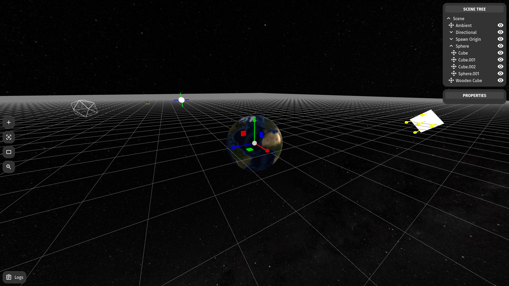

Here what follows is terrible English and absolutely horrendous Rust code. You may copy, modify, redistribute modified or verbatim copies according to one or both of the licenses mentioned below.

# Moksha

This is an experimental video game written in rust. Building an editor of some sorts is the first priority; the actual game will follow. Keep note that this can be used as a library but is not intended as such since the code quality and feature set has a long way to go before being library worthy.

After many attempts and blunders, I have finally settled for wasm-bindgen. My first attempt was to try three-rs (<https://gitlab.com/nrayamajhee/moksha-three>). It was a good starting point, but I eventually learned some WebGL and GLSL, which led me to abandon three-rs's three-js like abstraction. I then thought, I would instead write my own vulkan based renderer (<https://gitlab.com/nrayamajhee/moksha-vk>), which turned out to be an agonizing journey that was well beyond my capabilities. Hence, I am here, using wasm-bindgen's webgl binding. Hopefully someday WebGPU kicks off and drags me back to vulkan like code base.

## How to?

### Setup:

To install rust. Follow the `custom` setup and choose `nightly` after running the following command:

```bash
curl https://sh.rustup.rs -sSf | sh
```

`rust nightly` is a must because I use `maud` for templating which uses procedural macros.

(Alternative) If you run Arch Linux, the following will do.

```bash
pacman -S rustup
rustup default nightly
```

To install wasm-pack:

```bash
curl https://rustwasm.github.io/wasm-pack/installer/init.sh -sSf | sh 
```

(Alternative) If you are on Arch, you can find `wasm-pack` in `AUR`.

### Run the game:

```bash
git clone https://gitlab.com/nrayamajhee/moksha.git
cd moksha
./moksha build
./mksha serve
```

### Run tests:

```bash
./moksha test
```

Running test headless on `firefox` seems to break CI/CD at the moment, so I use `chrome` for testing. Tests are non existent at the moment so will revisit this later.

### Generate docs:

```bash
./moksha docs
```

The `moksha` script runs basic `wasm-pack` commands. Check it for further details. This is the current options

```bash
./moksha
moksha [(w)atch | (b)uild | (c)lippy | (d)ocs | (s)erve | (t)est]
```

## Preview 

The entire project is deployed at <http://moksha.rayamajhee.com>. This is continuously deployed with every commit in `master`.

This was the initial setup for `moksha-three`. My goal is to eventually write abstractions (editors, shaers, etc.) to be able to recreate this:


This is what the editor currently looks like:



## Rust-lang usage, browsers, and performance

Although, I have been learning rust for a while and was writing some C/C++ in the past, I am in no capability to judge how idiomatic my code is nor how healthy its memory management is. This program, although robust to my eyes does have some memory issues. I can't quite figure out if its my code, or firefox's WebGL driver, but I suspect there's some memory leaks as firefox's memory usage only climbs when run. Chrome, on the other hand, works perfectly fine. Also note that firefox on linux has very poor WebGL performance. There are multiple issues on Bugzilla about this. Although firefox is my browser of choice, I recommend running chrome for maximum performance.

Due to wasm-bingen's lack of support for rust lifetime annotations, I make heavy use of `Rc<RefCell>` pattern to pass the structs to event handlers. Although, I can ditch wasm-bindgen's javascript endpoint and use lifetimes notations, I think it is better to expose all my structs and functions to javascript so that if anyone wants to use this library from javascript, it is as feature rich and complete.

The core engine strives to be data-oriented (ECS like). I am no expert here and although I should have chosen a rust library that already provides efficient data structure. But I refuse to do so mainly because of ergonomic reasons and also my personal hubris. This is my attempt at writing a large code base and thus intentionally will carry all my crude vocabulary. I am still moving internal states around as I learn various approaches, but I hopes someday the essential states and components will live in a performant and coherent structure.

## ToDo

### Storage

- [x] Storage to hold all the data
- [x] Reorganize VAOs into Storage
- [ ] Cap the framerate for performance.
- Debug firefox's memory leaks.
- Follow Raph Levien's approach (<https://youtu.be/4YTfxresvS8>) and integrate child parent relation into storage itself.

### Scene

- [x] Scene tree that allows node creations
- [x] Add primitive meshes
- [x] Add obj from included/uploaded files
- [x] Add cubemap skybox
- [ ] Load scene from GLTF
- Implement curves
- Implement Mesh Skinning

### Renderer

- [x] Rendering component that holds, compiles, and binds shaders
- [x] Unshaded Color
- [x] Albedo  Map
- [x] Lights (Ambient, Point, Directional, Spot)
- [x] Barycentric Wireframe
- [ ] Blinn-Phong Shading Model
- [ ] Vertext Color
- Normal Map
- Metallic/Roughness Map
- Occlusion Map
- Reflection and HDR Cubemaps
- Volumetrics
- Procedulal Texures (Fbm, Perlin, Voronoi, etc.)

### Editor

- [x] Custom logging screen
- Toolbar
	- [x] Zoom and Switch Perspective controls
	- [x] Add menu to add mesh andlights
- Node tree viewer
	- [x] Implment open/collapse and render toggle. 
	- [x] Implement drag and drop for node parent/child relations.
- Implement a notification panel and notify macro with progress bars
- Mesh outline while selecting
- Configuration Editor
- Create a fps meter
- Transformation Gizmo
	- [x] Translation
	- Rotation
	- Scale
	- Implement a view snapping gizmo. (This will need rendering on a separate framebuffer)

## Viewport

- First Person Control
- Allow multiple cameras and animations
- [x] Third Person Controls
- [x] Perspective Projection
- [x] Orthographic Projection

### World

- [x] Load Milkyway Skybox
- Displace the Icosphere vertices with noise function and vertex paint it.
- Add plane model.
- Render Sky Model for Day/Night cycle
- Implement level of detail for Icosphere vertices.
- Add plane model.
- Volumetric Clouds
- Instanced Trees

### Controller

- Fly Navigation: Accelerate, De-accelerate, Roll, Pitch, and Yaw
- Walk Navigation: Accelerate, De-accelerate, Turn, Strafe, Jump, Roll, Crouch, Crawl
- Drive Navigation: Accelerate, De-accelerate, Turn

## Physics

- Gravity
- Collision with surfaces

## License

Although, I doubt that these are relevant at this point, nonetheless here it is: 

Licensed under either of the following terms at your choice:

  - Apache License, Version 2.0, (LICENSE-APACHE or http://www.apache.org/licenses/LICENSE-2.0)
  - MIT license (LICENSE-MIT or http://opensource.org/licenses/MIT)

Unless you explicitly state otherwise, any contribution intentionally submitted for inclusion in the work by you, as defined in the Apache-2.0 license, shall be dual licensed as above, without any additional terms or conditions.

Data contained in the repository (images, gltf, blend, etc.) that are created by me are licensed under Creative Commons Attribution 4.0 International License (CC BY 4.0).
Refer to https://creativecommons.org/licenses/by/4.0/ for the details. For others,
please refer to the links at /assets/credits for individual attributions for the blend file used to generate the skybox, and the deep star map from NASA.

A final note to smart/evil humans out there: If you don't care nor respect legal documents and simply hate any slight attempt at bureaucracy, what the above words mean is that if you use this source code, please kindly recognize my copyright. You may use it permissively (aka. in a non-copyleft manner). If you ever get delusional and believe that you've somehow struck gold here and can trade it for petty human dollars, I simply don't give a shit about your efforts, nor do I demand your modifications back. A humble acknowledgment will suffice. This is merely a past-time, an attempt at liberation from this monotonous and lonely life, a dream from a mind full of darkness, a sink to all my erratic musing, and obviously incompetent scribbles.

If you want to collaborate, or have questions, please do hit me up. Create an issue, or email me, or send a pull request: do what you usually do.
